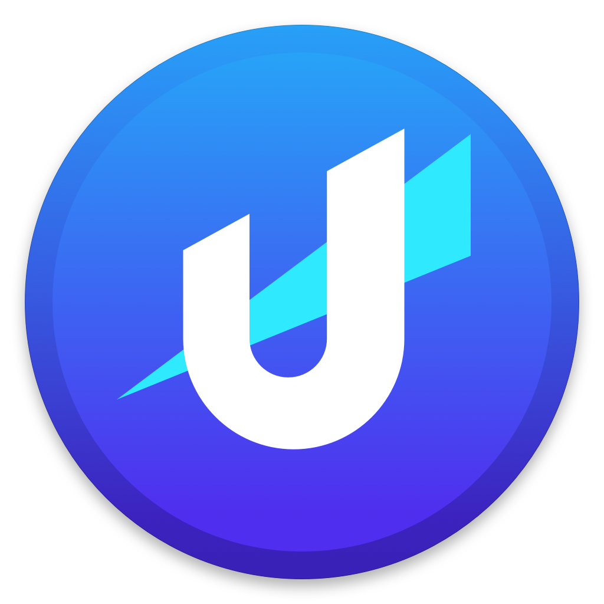
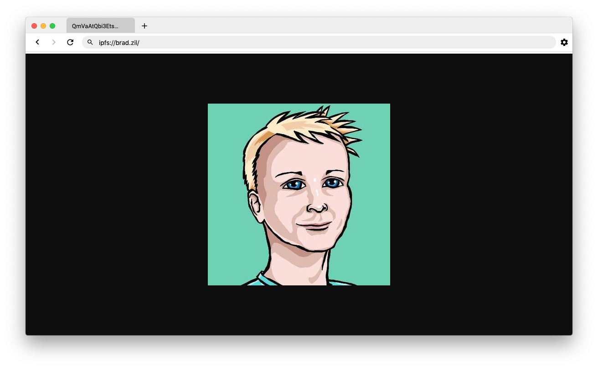

<p align="center">
  <a href="https://unstoppabledomains.com"></a>
</p>


<div align="center">
  <h1>Unstoppable Demo Browser</h1>

  <p>
  The Unstoppable Demo Browser is a web browser that can browse the decentralized web. Use it
  to visit blockchain TLD websites.
  </p>
</div>

# Motivation

[Unstoppable Domains](https://unstoppabledomains.com) is building a new DNS system. Unlike traditional DNS systems (which store domain data on centrally managed servers) Unstoppable DNS data is stored on the blockchain. This architecture has two big benefits. 

* **Domain lookups are impossible to block**
* **Domain names are impossible to seize**

By combining blockchain domains with websites and content hosted on peer-to-peer filesystems you can build and deploy your own uncensorable website, content, and service. 

Use the Unstoppable Demo Browser to experience and explore the uncensorable web today.

# Screenshots



# How we resolve domain names

## API

Unstoppable provides an API for blockchain domain name lookups. By default the Unstoppable Demo Browser queries an API to figure out what an address maps to because direct blockchain lookup is a bit slow. This makes browsing easier.  For a more trustless approach you can resolve domain names using direct blockchain lookups by configuring the settings in the browser.

## Using 3rd party blockchain APIs

You can also use a 3rd party API like Infura or other well known trusted API's to resolve blockchain domains.  This method puts trust in the validity of the API of your choosing. If you want a more trustless approach you can resolve domain names directly from the blockchain itself.

## Directly off the blockchain

If you are running a local copy of the blockchain(s) you wish to resolve, or you have a particular node you trust this method will read domain data directly from your own node. This method is fairly trustless.


# How we load IPFS websites

The [IPFS](https://ipfs.io/) stores files by hash on a distributed peer-to-peer network. IPFS files can be referenced by a unique hash --> QmUD69diRF8jwju2k4b9mD7PaXMjtMAKafqascL18VKvoD --> try remembering that.

You can use this unique hash to retrieve files off the IPFS network. These files can be images, web pages, pdfs, anything. The Unstoppable Demo Browser supports loading static html websites off of the IPFS network.

We support 2 main methods of loading IPFS sites. CDN-based loads and direct loads.

## Via CDNs

CDNs are networks of servers managed by companies like [Cloudflare](https://www.cloudflare.com) and [Infura](https://infura.io/) that cache and mirror content to help improve load times and distribute request load.

Both of these companies provide services that cache content from the IPFS network and serve it over standard HTTP connections.

The advantage of this approach is that pages load fast.

By default the Unstoppable Demo Browser retrieves content from CDNs. If you are concerned with censorship or are interested in IPFS web browsing experience you can load load data directly off of IPFS.

## Directly off the IPFS filesystem

We can also load data directly off of IPFS. If you use this approach you should expect slower performance since files on IPFS are fetched differently from files stored on standard servers.

# Running the code for this project

## Project overview

The Unstoppable Demo Browser is based on [Electron](https://electronjs.org/). Websites are rendered using Chromium (the same engine that powers Google Chrome) while the browser UI and control logic is implemented in JavaScript.

The project also uses [Typescript](https://www.typescriptlang.org/), [React](https://reactjs.org/), [Styled Components](https://www.styled-components.com/) and [Mobx](https://mobx.js.org/README.html). Project files are compiled with [Webpack](https://webpack.js.org/).

Electron applications are usually built in two pieces. There is a main application (src/electron/index.ts) --> this code opens a blank chrome window and loads html into that window. Then there is the html content that defines the UI and application flow (src/browserui/views/browser/index.tsx).

When you want to develop for this project you will need to run a process to generate the HTML alongside a process for the browser window.

## Setup

If you haven't already...
* [Install git (for downloading code from this repo)](https://gist.github.com/derhuerst/1b15ff4652a867391f03#file-mac-md)
* [Install npm (required to build this project)](https://www.npmjs.com/get-npm)
* [Install VSCode (an ide for working with typescript - recommended)](https://code.visualstudio.com/)

Clone this repo to your local computer -->

```
git clone https://github.com/unstoppabledomains/unstoppable-demo-browser
cd unstoppable-demo-browser

# Use npm to install project dependencies

npm install

# Dependencies will be installed into the node_modules folder
# Globally install the following dependencies

npm install --global webpack
npm install --global webpack-dev-server
npm install --global cross-env

```

Open the unstoppable-demo-browser folder in VSCode. You're good to go.

## Running the project

Running this project involves starting 2 separate processes. 
* The renderer process (npm run dev) generates html that describes the browser UI and handles user clicks and actions.
* The main process (npm run start) launches a blank browser window and loads content from the renderer into it.

To launch the browser -->

```
# Open two terminals. Make sure you're in the unstoppable-demo-browser folder in both terminals
# If you're not in the unstoppable-demo-browser folder you can use the 'cd' command to get there 

# Start the renderer process in the first terminal
npm run dev

# Wait for the renderer process to boot up --> 
# this needs process needs to boot first so that there is HTML content to load into the main process browser window

# Start the main process in the second terminal
npm run start

# A browser window should show up
# If all you see is a blank window check to make sure that the renderer process booted up successfully
```


## Building a release

The source for the Unstoppable Demo Browser is written in Typescript and React. These languages get compiled into vanilla JavaScript by Webpack.
The output for the compile process are js and html files that are located in the build sub-folder.

```
# You can trigger a build operation by running -->

npm run build

# Check the build sub-folder and notice app.html and app.bundle.js files. 
# These files are the html content that gets loaded into the main process browser window.
```

To build a release -->

```
# For mac
npm run compile-darwin

# For win
npm run compile-win

# Mac OS can compile both windows and mac builds... but windows can only comiple windows builds :p

# You will find the output of this operation in the dist folder
```

To publish a release to github --> [instructions for electron builder](https://www.electron.build/configuration/publish)
[To setup a github token](https://help.github.com/en/github/authenticating-to-github/creating-a-personal-access-token-for-the-command-line)

Create a new github token with write:packages and read:packages permissions

Add the github auth token to your environment variables
```
# Mac
vim ~/.bash_profile

# Add aline for GH_TOKEN

# Win
# Use the environment variable config screen... tutorial
# https://superuser.com/questions/949560/how-do-i-set-system-environment-variables-in-windows-1
```

Update the version number in package.json

Run the compile command

A release should get generated on your local machine in the dist folder and should get uploaded to github

You should be able to see the release on github under the releases tab

To test the auto-update feature locally you will need to create a local dev-app-update.yml file in the root directory with the following contents.

```
provider: github
publishAutoUpdate: true
repo: 
owner: 
```

### App signing and notorizing Applicaitonon on Mac

#### App Signing

If you want to build a mac executable where auto-update works, you'll need to do the following.

1. Download XCode
2. Sign up for an Apple Developer Account
3. Open your local Keychain and generate a key for Apple to notorize
  1. Keychain Access --> Certificate Assistant --> Request a certificate from a certificate authority
  2. Save the generated file to your desktop
4. Notorize your generated file on developer.apple.com
  1. Certificates --> + --> Apple Distribution
  2. Upload the generated file for notorization
  3. Download the resulting production.cer file
5. Double click production.cer to put it into your keychain
  * Note... at first we didn't have XCode installed and were getting errors about certificate not being trusted... so you'll need to install XCode for this to work

After this running `npm run compile-darwin` will generate and upload a signed version of the browser to github.

If you just want to test building a browser locally you can run `npm run compile-darwin-local`.

It can be hard to know if the app signing process is working. I found an application called [RBAppChecker Lite](https://brockerhoff.net/RB/AppCheckerLite/) that allowed me to see the signature information and make sure it was correct.

#### Notorizing

Starting with MacOS 10.14.5, all signed applications by ‘new’ developers will need to be notarized or they will trigger Apple’s Gatekeeper software and prevent users from installing your app.

https://kilianvalkhof.com/2019/electron/notarizing-your-electron-application/

# Contributing

If you have found any bugs or questions feel free to open an issue. If you are interested in working with [Unstoppable Domains](https://unstoppabledomains.com/) please get in touch via the Unstoppable Domains website.

# Useful resources

If you're new to the JavaScript ecosystem and want to understand typescript [I found this guide to be helpful](https://medium.com/free-code-camp/how-to-set-up-a-typescript-project-67b427114884#51cb).
